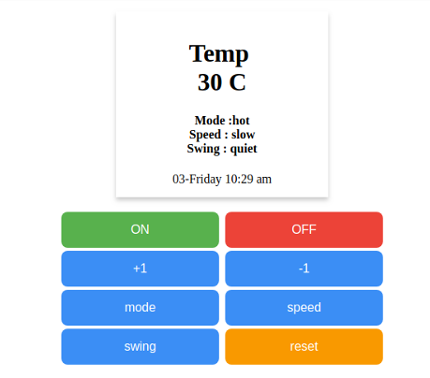

# PHP Unitest
Php unit tesing using phpunit.

Ac-remote features:
   1. submit using both post (indexpost.php) and get (index.php).
   2. data persistence using files.

Implemented for education purpose only.   
  ### Screenshots

